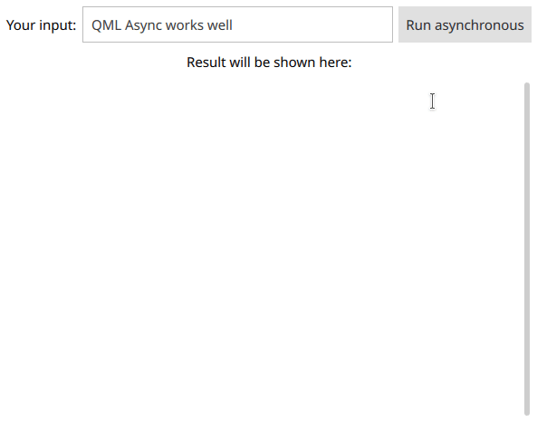

# Example of usage of QThreads in QML

This folder consists of sources for [How to use QThread from QML while having QML function async too](https://stackoverflow.com/questions/56126649/how-to-use-qthread-from-qml-while-having-qml-function-async-too)


# Application run example

## Application execution




## Expected output

```
Now worker is placed in:  QThread(0x560526366240, name = "MainThread")
Now worker is placed in:  QThread(0x560526414030, name = "WorkerThread")
Doing some job here...
Input string:  "QML Async works well"
Now worker is placed in:  QThread(0x560526366240, name = "MainThread")
Now worker is placed in:  QThread(0x560526414030, name = "WorkerThread")
Doing some job here...
Input string:  "QML Async works well"
Now worker is placed in:  QThread(0x560526366240, name = "MainThread")
Now worker is placed in:  QThread(0x560526414030, name = "WorkerThread")
Doing some job here...
Input string:  "QML Async works great"
Quit worker thread, and wait until it ends.
```

# Obtaining sources

If you want download **only** this folder (`QThreadInQML`),  you must execute next command:
```
svn checkout https://github.com/troyane/StackOverflow-pro/trunk/QThreadInQML
```
