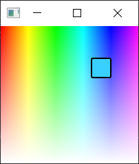

# Example of how to get pixel color of QML element under mouse cursor 

This folder consists of sources for question ["Getting color from QML Gradient at current mouse coordinates" at SO](https://stackoverflow.com/questions/64738357/getting-color-from-qml-gradient-at-current-mouse-coordinates).



---

Idea behind this application is:
* Grab a screenshot / store static image (e.g. after width/height change) using `Item`'s [`grabToImage`](https://doc.qt.io/qt-5/qml-qtquick-item.html#grabToImage-method) method.
* Draw stored image on [`Canvas`](https://doc.qt.io/qt-5/qml-qtquick-canvas.html) using `Context2d`'s [`drawImage`](https://doc.qt.io/qt-5/qml-qtquick-context2d.html#drawImage-method-2) method.
* On mouse move:
  * Extract [`CanvasImageData`](https://doc.qt.io/qt-5/qml-qtquick-canvasimagedata.html) at position `mouseX`, `mouseY` via [`getImageData`](https://doc.qt.io/qt-5/qml-qtquick-context2d.html#getImageData-method) method. 
  * Having 1px x 1px = 1px `CanvasImageData` (that is one-dimensional array containing the data in RGBA order, as integers in the range 0 to 255) extract pixel color and store it as `currentColor` (to set color you can use [`Qt.rgba`](https://doc.qt.io/qt-5/qml-qtqml-qt.html#rgba-method)).
  * Use your `currentColor` as you want.


# Obtaining sources
If you want download **only** this folder (`grab_qml_item_pixel_color`),
you must execute next command:
```
svn checkout https://github.com/troyane/StackOverflow-pro/trunk/grab_qml_item_pixel_color
```
